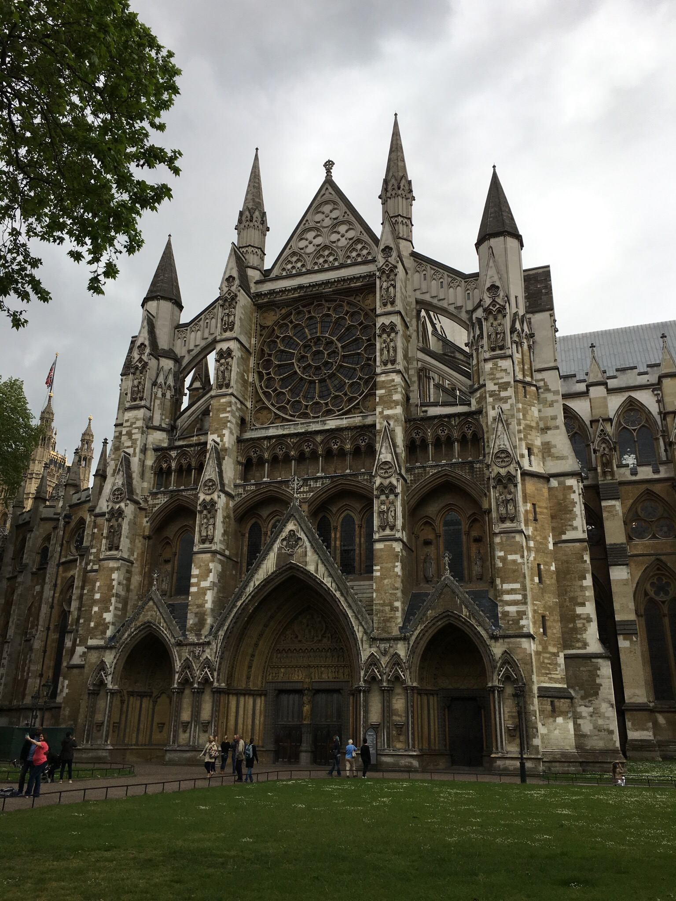
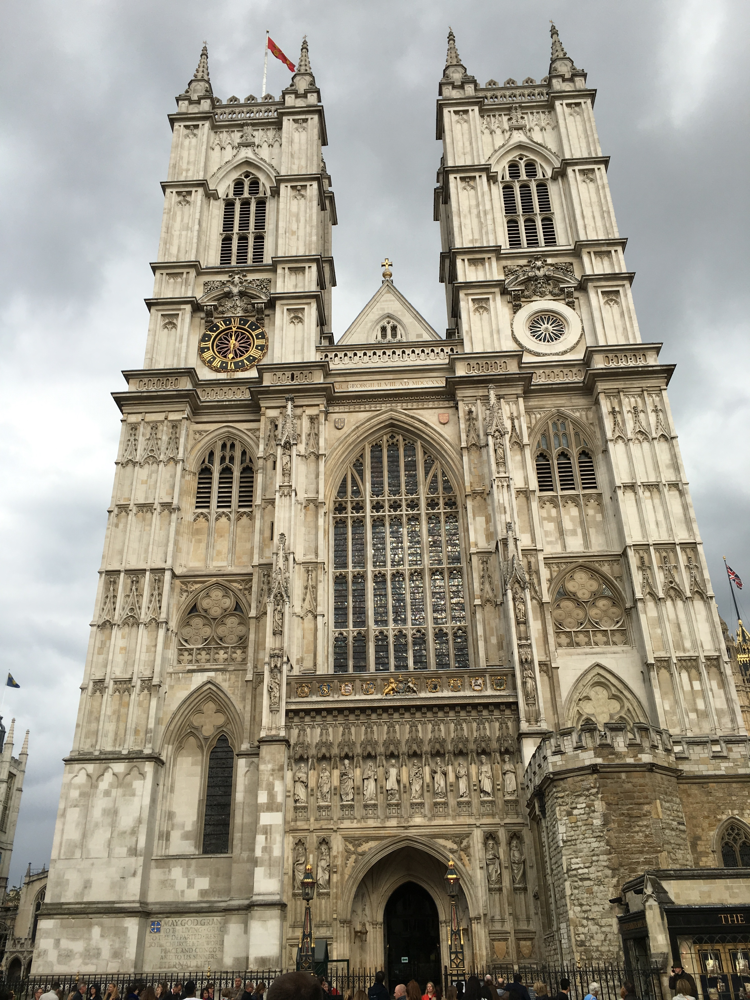

Churches
========
England is home to some of the most beautiful churches in the world. One of the most notable ones is 
The Westminster Abbey:

Westminster has a rich history. Originally the structure was just a small monastery. It was eventually reconstructed as a stone church by King Edward in 1040. 
A few hundred years later, it was destined to be remodeled by King Henry III in 1269; the new design was set to be a New Gothic Style Church. 
While some of the church was completed, King Henry III died during renovation causing the project to go unfinished. This resulted in the Church consisting 
of two clearly different styles. Other additions include the West Towers (1745), and the Lady Chapel (1516).

Aside from its unique design, The Westminster Abbey has a lot of historical meaning behind it. All the monarchs that have been crowned since 1066 were crowned in 
the Abbey. There are also more than 600 artifacts that have honored historical figures of the past. Some include Martin Luther King Jr. and Winston Churchill. 
Moreover there are famous historical figures buried at the church such as the Father of Evolution, Charles Darwin and remarkable author, Charles Dickens.

One more look at the Westminster Abbey...

 

There are many other historical, beautiful churches in England. Check some of them out below:

+------------------------+------------+
| Church Name            | Location   | 
+========================+============+
| Durham Cathedral       | Durham     | 
+------------------------+------------+
| Wells Cathedral        | Wells      | 
+------------------------+------------+
| York Minster           | York       | 
+------------------------+------------+
| Westminster Abbey      | London     | 
+------------------------+------------+
| Westminster Cathedral  | London     | 
+------------------------+------------+
| Holy Trinity Brompton  | London     | 
+------------------------+------------+
