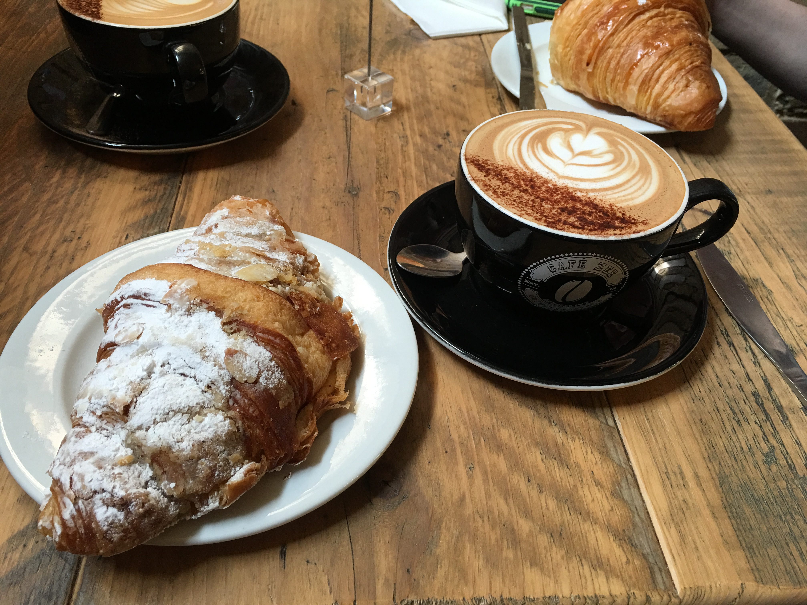
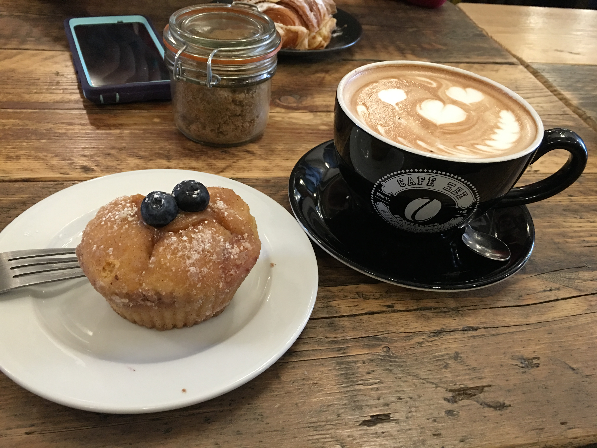
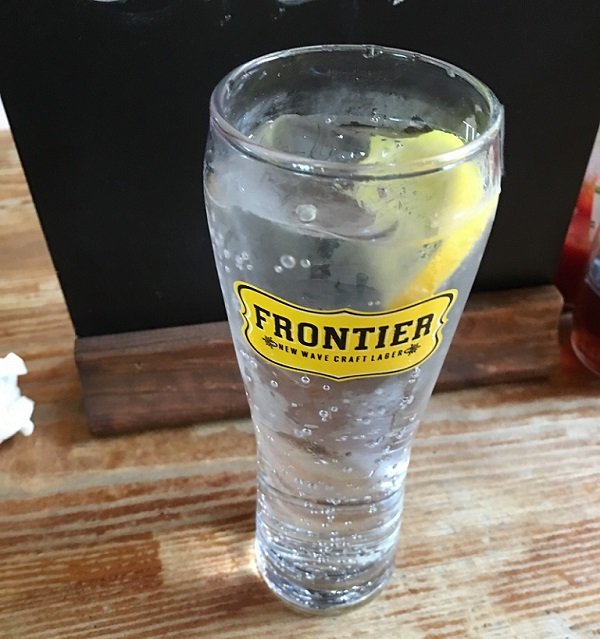

Eating in London
================
Pubs are a huge thing in London, there is no shortage of them. There were definitely 
many meals spent at pubs. It is a little odd going to them at first, but eventually 
you become accustomed to them. For starters, there is a sort of chain of pubs in London. 
However, they aren't a chain like McDonald's or Applebee's is a chain. The pubs are individually 
owned and have unique names. In fact, the only way you'll be able to tell you are at 
one of the chains is the menu. They have the exact same choices. The food is fine, but 
pubs that are not a part of the chain were in another league. There are many great 
restaurants but I will take you through my personal list of best places to go for every meal.

Breakfast- Cafe Zee
-------------------
This place was my cafe. Now I'll be honest, I'm a Starbucks person and I had that plenty of 
times while I was there, but this place is better. Whenever we had a free morning we came here. 
First of all, the people were great. The workers were incredibly friendly, and by the 
second time we went there, they recognized us. Secondly, the food! Wow! It was the same 
price as what our hotel was charging for a breakfast of little packs of dry cereal 
(I wish I was joking), and it was so much better. Actually, considering what it was up 
against, that comparison means nothing. The food was great! I had the almond croissant 
multiple times; it was perfect. The last time we came in the almond croissants were gone 
so instead we had donut muffins. We may have gone through the five stages of grief 
realizing we could've been eating those the whole trip. I wish we could've eaten there 
everyday, but unfortunately our group leader didn't believe in feeding us so we only got
to eat when we weren't with him. I still miss this place.

Lunch-Francesca
---------------
So we just randomly found this restaurant while searching the area around the Sherlock 
Holmes museum. It was a Subway type place for Italian food, which is possibly the coolest 
concept for a restaurant I've ever heard of. You got to pick your type of pasta and 
type of sauce and then they mixed it together for you so you didn't just get a pile of 
sauce on a pile of pasta. If this doesn't sound groundbreaking to you, you obviously 
don't eat a lot of pasta, and I'm sorry for you. Anyways, that would mean nothing if it 
didn't taste good, but it did. The food was great, you got a huge portion, and it was 
reasonably priced. I wanted to go back (and still do) but we were never back in the area. 
But if you're around I highly, highly recommend it.

Dinner-Rosemary Pub
-------------------
Do yourself a favor and eat here! You won't regret it. I haven't eaten at every pub in London 
but I still feel confident in saying the Rosemary Pub is the **best** pub in London. When 
you eat here, you're going to want to get the beef burger. It is easily the best burger 
I have ever had in my life! No where else even comes close. It is slightly sad to have 
peaked on the level of burger I will eat at such a young stage in my life, but truly worth 
it! I wish I had a picture to share of it but I don't because I ate it .2 seconds. I would 
be sorry except that I'm not at all. Also, at this restaurant, they had magic lemonade. 
The drink they handed me looked like Sprite, but it wasn't! It was lemonade! It was the 
strangest thing I have ever experienced and I made everyone taste-test it so they could 
get just as freaked out about the drink as me! 10/10 would go again immediately. 

Dessert- Creams Cafe
--------------------
Gelato- need I say more?