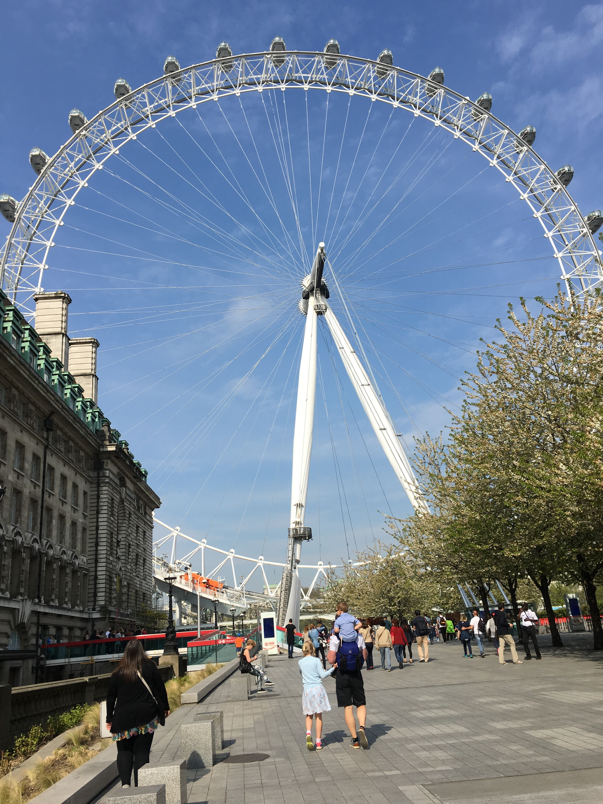
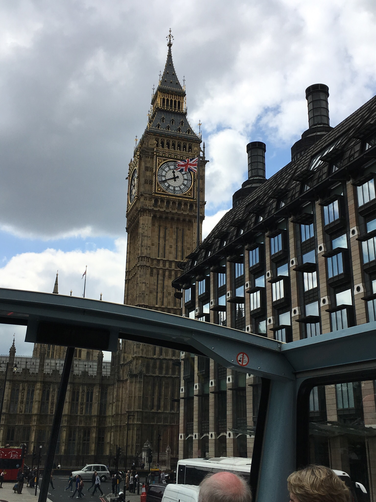

Home
====
England is an island country bordering Scottland, Ireland, and Wales.  It is one of the four nations to make up the United Kingdom, that dates all the way back to May 1, 1707.  With a population of 53.01 million, England has a large, diverse culture and a long history. Laying on the beautiful River Thames, England's captial, London, is the home of Parliament, Big Ben, the Eye, and the 11th-century Tower of London.  Go back in time and visit the Tower of London, Westminster Abbey, St. Paul's Cathedral, Buckingham Palace, or the Globe theatre. If you're interested in food visit one of the amazing pubs this city has to offer. See a football game in any of the large cities that host one of the Premier League football clubs. England is also a great destination for modern art and business.  Outside of London, England has dozens of large cities and small towns that all have something special and unique to offer. 

**The Eye**, or Milennium Wheel, is a gaint Ferris wheel on the bank of the River Thames and is a great spot for tourists.

**Big Ben** is the Great Bell of the clock tower at the north end of the Palace of Westminster.