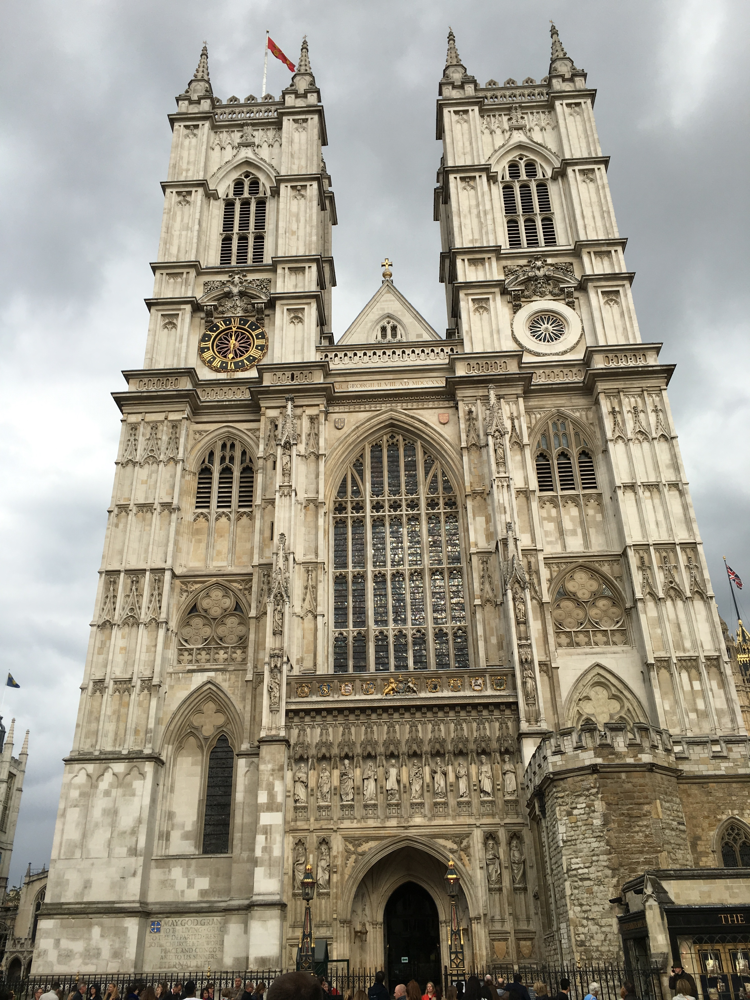
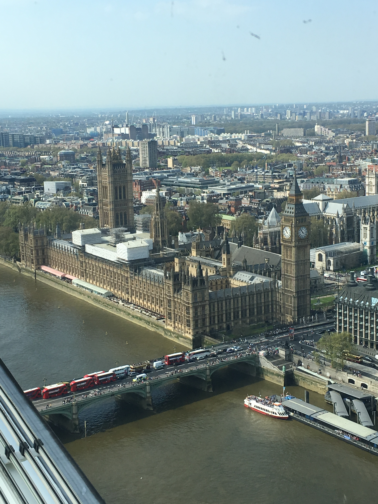

Parliament
==========

History
-------
The English parliament is one of the oldest continuous representive assemblies in the world.
Here are important dates that explain how the parliament started and shows how far back Parliament goes:
	
	1. 1215, creation of the *Magna Carta* forming the King's Great Council
	2. 1236, first use of the term parliament to describe the King's Great Council
	3. 1258, *Provisions of Oxford* call for the regular parliament with representives from every county
	4. 1295, the model made up of nobles, bishops, and two representives from each county and town.
		* This was the model for future parliaments

Today Parliament is split between two chambers, the Upper and Lower Chambers.  The Upper Chamber, or House of Lords, is the smaller of the two chambers, and the Lower Chamber, or House of Commons, is the larger chamber holding 650 representives.  Despite their names, the Lower Chamber is the more powerful political group.  Both chambers meet at the Palace of Westminster *(below)*.

Palace of Westminster
---------------------
The Palace of Westminster sits on the north bank of the River Thames in London.  The palace has a very long history.  It was orginally built in 1016 and stood for over 800 years until in 1834 it was completely destroyed in a fire started by an overheated stove.  It was reconstructed over a 30 year span starting in 1840 and ending in 1870.  During World War 2, the palace was bomded 14 different times but stayed mostly intact and was repaired where needed after the war.  Today there are plans to possibly restore the structure in the spring of 2016.  This would force parliament to meet in a temporary location.

