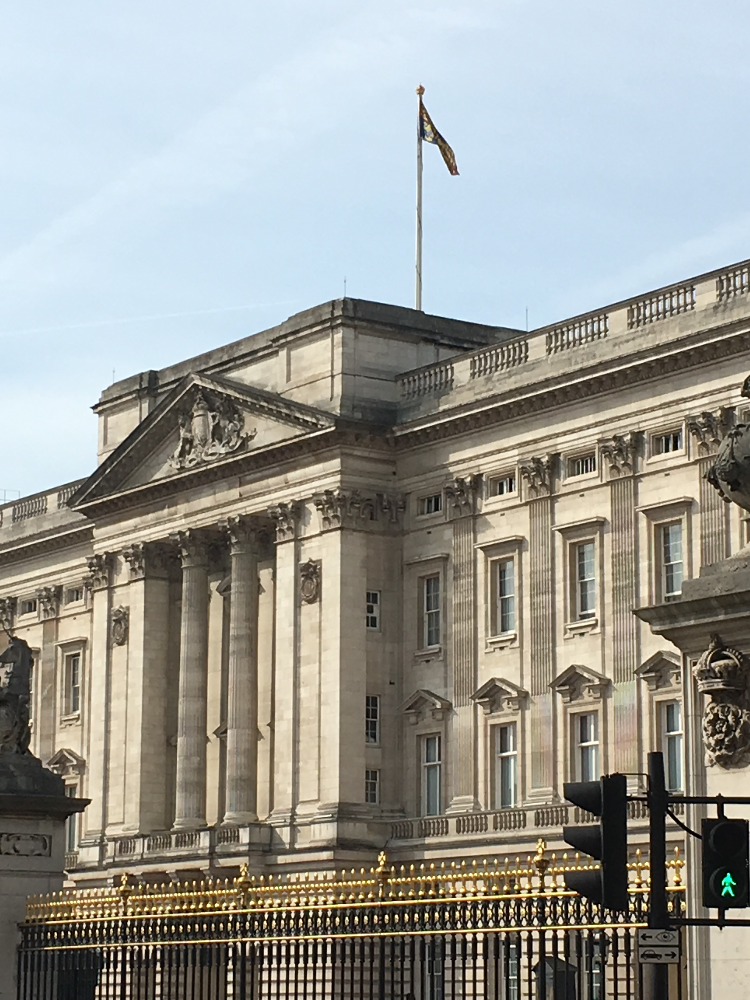

Royal Family
============

Members
-------

+------------------------------+---------------------------+
| George VI                    |  Father of                |
| 1896 - 1962                  |  Elisabeth II             |
+==============================+===========================+
| Elisabeth II                 | Daughter of               |
| 1926                         | George VI                 |
+------------------------------+---------------------------+
| Charles, Prince de Galles    | Son of                    |
| 1948                         | Elisabeth II              |
+------------------------------+---------------------------+
| Princesse Anne               | Daughter of               |
| 1950                         | Elisabeth II              |
+------------------------------+---------------------------+
| Andrew, due d'York           | Son of                    |
| 1960                         | Elisabeth II              |
+------------------------------+---------------------------+
| Edouard, comte de Wessex     | Son of                    |
| 1964                         | Elisabeth II              |
+------------------------------+---------------------------+
| Peter Philips                | Son of                    |
| 1977                         | Princesse Anne            |
+------------------------------+---------------------------+
| Zara Philips                 | Daughter of               |
| 1981                         | Princesee Anne            |
+------------------------------+---------------------------+
| Prince William de Galles     | Son of                    |
| 1982                         | Charles, Prince de Galles |
+------------------------------+---------------------------+
| Prince Harry de Galles       | Son of                    |
| 1984                         | Charles, Prince de Galles |
+------------------------------+---------------------------+
| Princesse Beatrice d'York    | Daughter of               |
| 1988                         | Andrew, due d'York        |
+------------------------------+---------------------------+
| Princesse Eugenie d'York     | Daughter of               |
| 1990                         | Andrew, due d'York        |
+------------------------------+---------------------------+
| Lady Louise                  | Daughter of               |
| 2003                         | Edouard, comte de Wessex  |
+------------------------------+---------------------------+
| Vicomte Sevem                | Son of                    |
| 2007                         | Edouard, comte de Wessex  |
+------------------------------+---------------------------+
| Savannah Philips             | Daughter of               |
| 2010                         | Peter Philips             |
+------------------------------+---------------------------+

History
-------
The monarchy of the United Kingdom, or British monarchy started in 1066.  Originally starting as seperate monarchies in England, Scottland, and Ireland.  In 1705 the Scottish monarch and English monarch were merged establishing the Kingdom of Great Britian.  Then in 1801 Ireland followed, joining the Kingdom.  *(But in 1920, five-sixths of Ireland seceded, leaving monarch rule and forming the Irish Free State.)*  The monarchy of the United Kingdom is a constitutional monarchy that rules in the kingdom and in the territories overseas controlled by the kingdom.  In 1215 the *Magna Carta*, an important historic document, limited the power of the monarch and created a parallel governing body, parliament.  After World War II the monarch turned from the title of monarchy of the United Kingdom and tried to adapt the title *Head of the Commonwealth*.  In today's world parliament is considered more of the law making government body in the United Kingdom, while the monarchy is more ceremonial.  Today monarchs have responsibilities like bestowing honours and appointing prime ministers.  Buckingham Palace *(below)* is the London residence and political headquarters for the monarch in power over the United Kingdom.  The structure was built in 1703.  The Palace is a center point for British people in times of national pride and mourning.

