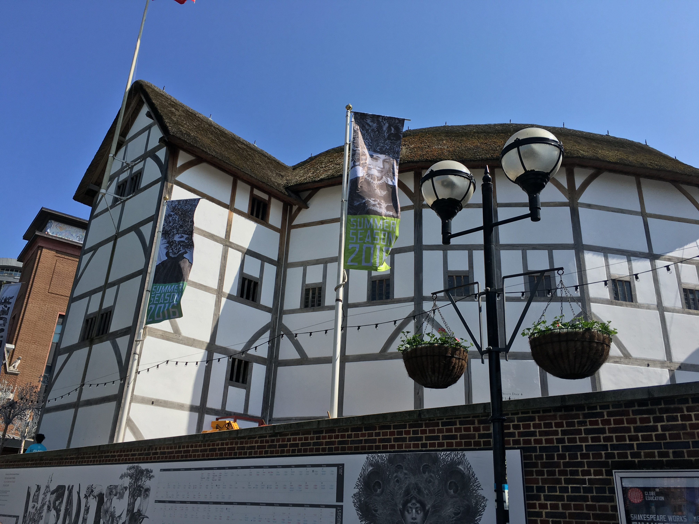
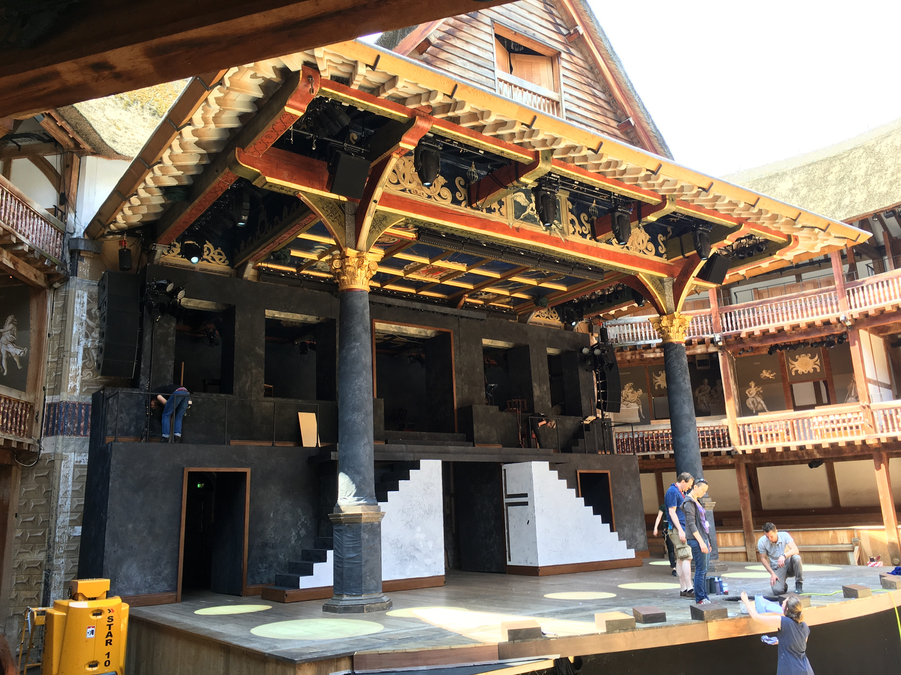

The Globe
=========

The Globe Theatre is probably the most famous theatre in the world. The Globe is most recognized with William Shakespeare, as it is the theatre that his company worked from and where all his plays were performed. Originally, the Globe was not built with its famous look. Unfortunately, that is about all we know about the original theatre because it burned down. We know they didn't rebuild it exactly the same because they found building plans for the Globe as we think of it, and there were references to features from other theatres that they wanted.

The Globe wasn't even originally in the location that it is now. The city passed a law that basically made it illegal to perform on the West Bank, which is where the Globe had always been located. The men of Shakespeare's company were so mad that once the River Thames froze over, they took apart the Globe, carried the pieces across the river, and rebuilt the theatre on the East bank in the middle of night. That is the level of petty I aspire to be, unfortunately nowadays there are building permits. Anyways, this is where the Globe stood until the Great Fire of London in 1666, which destroyed the theatre.

It seems weird to think about because the Globe seems like such an integral part of London, but after the fire there was no Globe for a long time. They didn't rebuild it, and had no plans to until American actor, Sam Wanamaker, came along. He started the movement to rebuild the Globe in the 50's. The building that is there now used the documents they found about rebuilding the Globe the first time, however it is still just a best guess about what it looked like.

I loved the Globe though. For starters, after the Great Fire buildings were no longer allowed to made of wood or have thatched roofs. Want to guess what the Globe is made of? That's right- wood and a thatched roof. It is the only building in all of London to be allowed this. Secondly, they never cancel shows. The stage is covered so sun, rain, or snow the show goes on. It was so cold when we went my feet went numb, but I wouldn't have missed a second. Lastly, it is the only theatre anywhere in the world where the less you pay, the better view you have. Technically, we had seats but some of us gave up them up to be groundlings, or people who stand during the shows. I did it to be warmer, but the experience of it was great! I wouldn't even buy seat tickets next time. You felt more invested when you were standing and made me appreciate the show even more.
