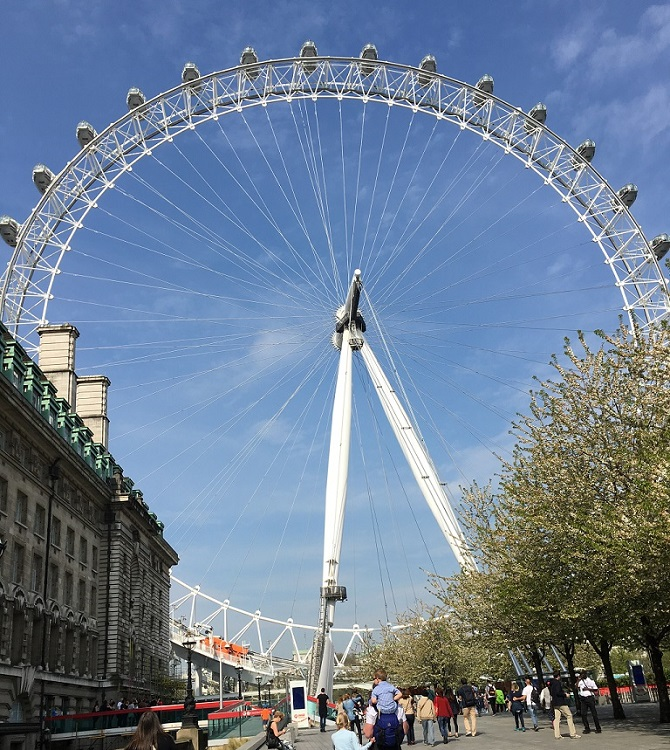
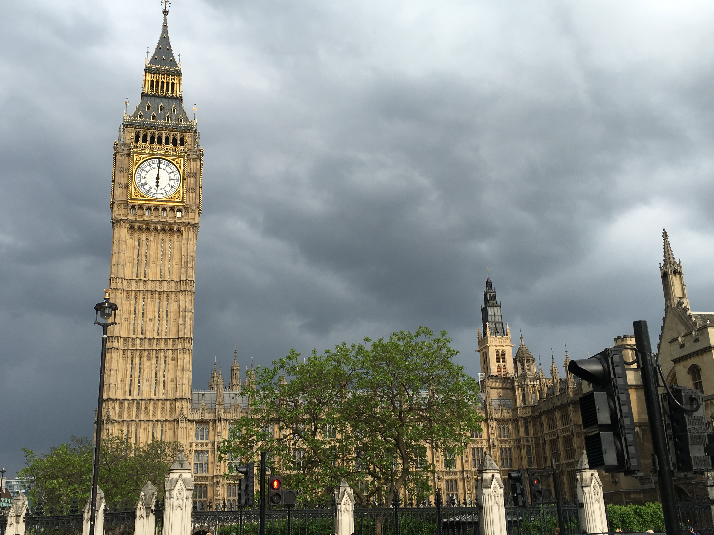

Tourist Sites
=============
The Eye
-------

10/10: Full disclosure- I just went to The Eye because we had a free morning and The Eye and the London Aquarium were close to where we needed to end up that afternoon. One of the best decisions I made on the trip! The Eye was incredible! You could see the whole city from up there. It was beautiful. The whole round trip takes about 30 minutes, and it moves so slowly you don't really feel it. The people I went with were afraid of heights and thought they would just sit on the benches and watch from the middle of the car, but it was too breathtaking! We were glued to the windows, watching the city pass by around us. I honestly could have immediately bought another ticket and rode it again. It was that great! The newest way to see the city from high up is the Shard. I can't say for sure because I didn't go there, but it didn't seem worth it. It was more expensive than the Eye and you're just looking out from the windows of the building. Perhaps, if you were going to make a meal out of it too then it would be worth it, but it just didn't appeal to me. To be honest the Shard was more interesting to me to look at than to look from. **Also of note: when you are buying tickets, please bundle them!** Had we not gotten the great ticket agent we did we might have missed out, but if you bundle tickets they are cheaper than if you buy them separately. We were just going to bundle The Eye and the aquarium because that was all we were going to be able to fit in that day, but the tickets are good for a month! So we got tickets for The Eye, the London Aquarium, and Madame Tussauds for 50! I don't remember all the other places that were offered but any you go to will offer the bundle and please take it!

London Aquarium
---------------
6/10: I'm not really a big aquarium person. Once you've seen one you've seen them all, but the London aquarium was fun. We had a great time, and it was a great way to spend the morning, but it was just an aquarium. The only thing that really made it stand out was the fact it was in London. So I would recommend it, and if I was with the same people I'd probably even go back, but it wasn't my favorite thing.

Madame Tussauds
---------------
8/10: **Please buy this in a bundle! I know I keep harping on this but if I hadn't bought this ticket in a bundle the ranking would've been 4/10!** The ticket price for this place on its own is 30 and it was not worth that! There were so many people you could barely get through some areas let alone take pictures. Also, the line to get tickets if you hadn't bought one before took forever, which I know because one person in our group hadn't. The only things that saved this place for me were the Marvel and Star Wars characters. For some reason the Marvel characters weren't as busy and I wanted pictures of them more than anything else. For Star Wars, if you wanted to see these characters you did have to pay an additional 5 whether you bought your tickets previously or not, but I thought this was worth it. You got be a part of scenes from the original movies and got to meet BB-8! Luckily for me, the characters I most wanted to see were less busy. If the person you're most hoping to see isn't in Marvel or Star Wars I'd be a little wary to spend so much money at this place.

Big Ben
-------

10/10: The clock tower is gorgeous. However, you don't really need to set this as a part of your schedule. If you are walking around London you are going to see this. I mainly am just putting this here to give you some important information I learned about Big Ben while I was in London. Big Ben is the bell inside the tower and not the clock tower itself. This has been your PSA. You're welcome.