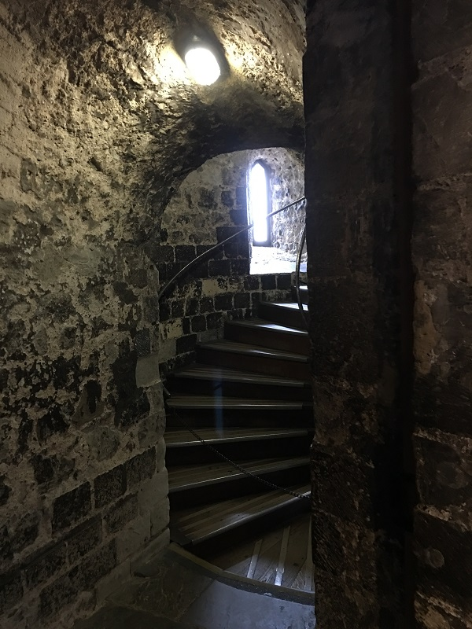

Tower of London
===============

History
-------
The Tower of London is rich with history. So much so, that detailing everything that has occurred there would be next to impossible. I will be as comprehensive as possible, though. In 1066, William the Conqueror built the tower in order to conquer England. He defeated and killed the king at the Battle of Hastings. After which, he assumed the thrown and his descendants have ruled England ever since. In the 1220’s Henry III starts a major expansion of the tower. He expanded and improved the royal palace and strengthened the Tower’s defenses. In 1483, Prince Edward V and Prince Richard go missing. They were sent to the Tower by their uncle. Once the princes were declared illegitimate, their uncle was crowned King Richard III, and the boys were never seen again. It is presumed that they were murdered, most likely by their uncle. In 1536, Anne Boleyn was beheaded on Tower Green on charges of adultery and incest. In 1671, Colonel Blood attempted to steal the Crown Jewels. He stabbed the Jewel House keeper, and almost got away with it but the keeper’s son returned and raised the alarm. After this, security tightened on the jewels and the public was no longer allowed to touch the jewels. In 1780, the last hanging takes place on Tower Hill. In 1835, the Royal Menagerie closes after several incidents where the animals had escaped and attacked other animals, guests, or staff members. The animals were transferred to the London Zoo. In 1841, the Crown Jewels are saved from a fire. Finally, in 2012, the Crown Jewels exhibition opened.

Admission Information
---------------------
There are multiple ways to get to the Tower of London. If you go by Underground the nearest station is Tower Hill. To get there, use District or Circle lines to Tower Hill station. Follow direction signs to the Tower. The main entrance is a five-minute walk from the station. If you took a train, the nearest stations are Fenchurch Street or London Bridge. You’ll follow direction signs from either station. Fenchurch Street is approx. a five-minute walk to the Tower, from London Bridge takes 15-minutes. If you plan to take a bus, take one of the following bus routes: 15, 42, 78, 100, or RV1. The Tower is also served by all major sightseeing bus tours.

The Tower hours are 9:00AM – 5:30PM Tuesday through Saturday and 10:00AM – 5:30PM on Sunday and Monday. The ticket prices are below 

===============================  ==========  ============
For visits through Febrary 2017  Gate Price  Online Price
===============================  ==========  ============
Adult 						     25			 23.10
Child (10-15)                    12          10.50
Student/Senior					 19.50		 17.60
===============================  ==========  ============
*All prices in local currency*

**Note:** It is best to go right before opening so you get into the Tower right away. The first thing to do is head directly back to the Crown Jewels, that way when you get there, there is relatively no line. Later in the day, the lines can get extremely long. When you are done looking at the jewels go back to the main entrance, and get in on the next Yeoman Warder Tour: they start every 30 minutes. Once the tour is over you can explore the rest of the tower by yourself. All in all, it will probably take the better part of four hours.

Things to Do
------------
There are many things to explore in the Tower. Probably the most famous are the **Crown Jewels**. Since the 1100s the Tower has held the personal jewels of the Monarchs. However, it was not until 1649 that the Tower held the coronation regalia. Until that point, items used in the coronation were kept at Westminster Abbey. These objects could not leave the abbey, so kings and queens of the time had their own personal crowns made to wear during their reign. The collection at Tower of London includes some of most extraordinary diamonds in the world. The Crown Jewels are still regularly used by The Queen. 

Next, are the **Yeoman Warder Tours**. The tours begin every 30 minutes (last tour 3:30PM). Tours last approximately 60 minutes and start near the main entrance. The Yeoman Warder Tour is one of the most popular attractions for visitors to the Tower. On the tour, Yeoman Warders, who are popularly known as Beefeaters, will entertain you with exciting stories of the Tower. It is common courtesy to tip £1 or £2 at the end of the tour, so make sure you have it. It is thought their nickname of Beefeaters is derived from their position in the Royal Bodyguard, which permitted them to eat as much beef as they wanted from the king's table. Today, Yeoman Warders are required to have served in the armed forces with an honorable record for at least 22 years. 

At the center of the Tower of London is the **White Tower**. It was built to awe and terrify locals and to discourage foreigners from invading. The White Tower is one of the most famous castle keeps in the world; a keep is a type of fortified tower built within castles during the Middle Ages by European nobility. There are also tours of the White Tower available. Tours run daily at 10:45AM, 12:45AM, and 2:15PM, and they meet in the Chapel of St. John the Evangelist. You can hear stories of the impenetrable fortress. Also, the White Tower houses the Royal Armories and the **Line of Kings** exhibit.

	**Line of Kings**, located on the entrance floor of the White Tower, is the world’s longest-running visitor attraction. The display has been re-arranged over the centuries, most recent of which happened in 2013. For over 300 years, Tower of London visitors have enjoyed seeing the displays featuring royal armor, life-sized wooden horses, and figures of kings. Some of the most elaborate and beautiful pieces of armor are on display in the Line of Kings. After the restoration of the monarchy in 1660, this exhibition was used to promote the king’s right to rule. Visitors at the Line of Kings today are following in the footsteps of 300 years of guests from all over the world. You can even read what historical visitors thought of the exhibition.

While at the Tower you should try to find the **ravens**. Ravens are the traditional guardians of the Tower, and are held in high respect. Legend says that the kingdom and the Tower will fall if the six resident ravens ever leave the fortress. Charles II was the first king who first said that the ravens of the Tower should be protected. The ravens even have their wings clipped, in a way that does not harm them, to ensure that they cannot leave the Tower. Despite this, some ravens do go missing and others are fired: Raven George was let go for eating television antennas, and Raven Grog disappeared outside an East End pub. There are seven ravens at the Tower today, the required six and one extra. Though it is a little unclear as to what ravens are there today as they list nine: Bran, Porsha, Erin, Merlina, Munin, Hugine, Rocky, Gripp, and Jubilee. The ravens preside over four different territories within the Tower precincts: Tower Green, Coldharbour Gate, Wall of the Inmost Ward, and Roman City Wall.

An exhibit that is not for the faint at heart is **Tower Torture**. It is located at the bottom of Wakefield Tower. In Tower Torture, you can see three terrifying instruments of torture. When using manacles they left the victim hanging by their hands with their arms above their heads. The rack was used to stretch the victim to their breaking point. The scavenger’s daughter was basically the opposite of the rack, instead of stretching the victim; it compressed or contorted the victim. There are two types at the Tower: one that “crushes a body like a nut cracker” and another that twists the person into agonizing positions.

Another exhibit is **Royal Beasts**. Wild and exotic creatures were held captive by kings and queens at the Tower of London. Founded in the early 1200s, animals lived at the Tower for over 600 years, at what was known as the Royal Menagerie. The first animals to live at the Tower were lions. All together, the Royal Menagerie had over 60 species on show. This included the polar bear that was allowed to swim in the Thames and the ostrich that was thrown nails to eat. At Royal Beasts, you can explore the stories of these and many more of the animals that were kept at the Tower, and experience how the animals would have lived. 

Inside the Tower there is also a museum. From its formation at the Tower to present day, the **Fusilier Museum** tells the story of the British infantry regiment. The museum houses many items such as uniforms, flags, silver, and insignia throughout different time periods. There is a medal collection, which includes 12 of the 20 Royal Fusilier Victoria Crosses. Foreign items, taken from enemies they had beaten or bought from locations they were stationed at, can also be seen at the museum. Last, but certainly not least, there is a comprehensive archive of photographs, personal letters, war diaries, and other objects that tell the stories of the Fusiliers.

The **Medieval Palace** at the Tower shows how royalty in the Middle Ages lived. Henry III and Edward I expanded the Tower’s defenses in the 13th century. The work they did to the Tower back then is responsible for the look of the Tower today. When they did this work, they also added a new palace. For hundreds of years to come, Kings and Queens stayed in the rooms they built. In the recreation they made of Edward I bedchamber, the bed was modeled after a painting showing the conception of Merlin, the wizard in the legends of King Arthur and Camelot.

**Tower Green** contains the memorial to the people who were killed at the Tower by order of the state. To be executed inside the Tower was a privilege because it meant the crowds were not able to witness your death. The most notable deaths were of the three queens that were executed here. Two, Anne Boleyn and Catherine Howard, were wives of Henry VIII, and the last was Lady Jane Grey who was only sixteen at the time of her execution. Around the memorial, Brian Catling, the creator of the memorial, inscribed “Gentle visitor pause awhile - where you stand death cut away the light of many days - here jeweled names were broken from the vivid thread of life - may they rest in peace while we walk the generations around their strife and courage - under these restless skies”.

In the **Wall Walk**, you can discover the huge stone encirclement that forms the Tower’s walls that have protected kings and queens since the mid-13th century. You can explore many attractions at the Wall Walk. At the South Wall Walk you can visit the Medieval Palace, St. Thomas’ Tower, Wakefield Tower, Lanthorn Tower, and Salt Tower. In the East Wall Walk you can see the Broad Arrow Tower, fighting platform, Constable Tower, and Martin Tower. Lastly, at the North Wall Walk you can go to Royal Beasts, Bowyer Tower, and Flint Tower.

*For more information go to their `website <http://www.hrp.org.uk/tower-of-london/#gs.4Z=B9mU>`*